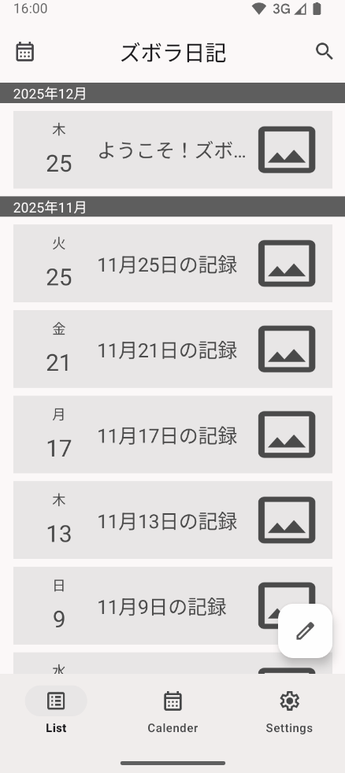
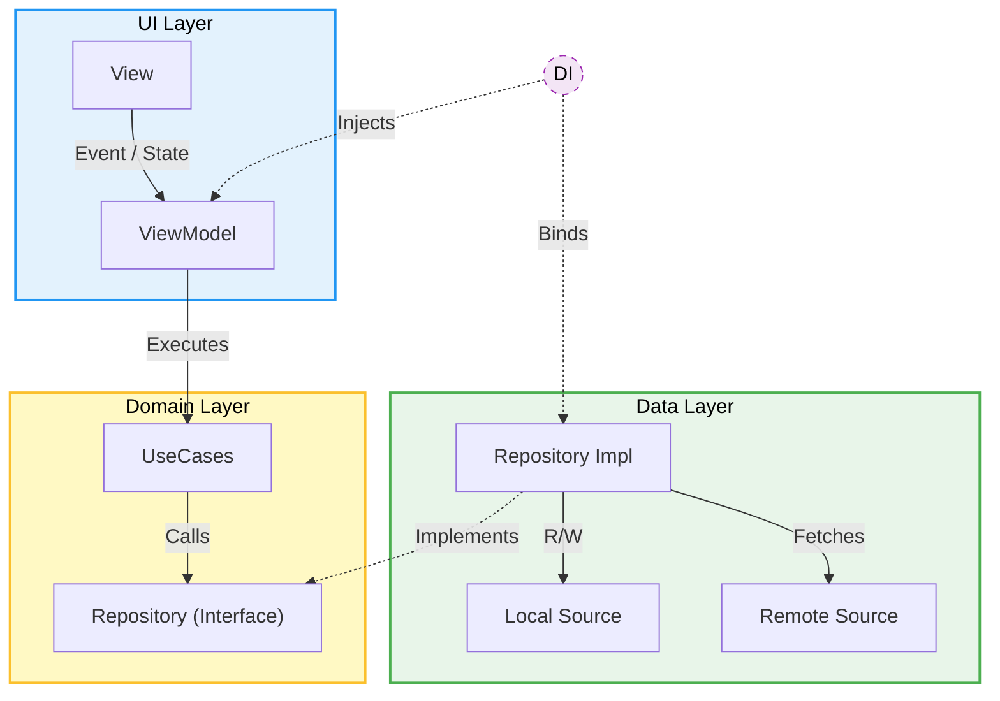

# ズボラ日記 (Zubora Diary)

**元制御エンジニアが設計した、堅牢性重視のAndroid日記アプリ**


## 📖 概要 (Overview)
「日記を書きたいが、文章を考えるのが負担で続かない」という課題に対し、**箇条書き形式**を採用することで、習慣化をサポートする日記アプリです。
「継続への心理的ハードルを下げるUX」と「ユーザーのデータを絶対に壊さない堅牢性」を軸に開発しました。

## 📱 アプリの機能 (Features)

<table>
  <tr>
    <th width="33%">作成・編集 (Create & Edit)</th>
    <th width="33%">閲覧・検索 (View & Search)</th>
    <th width="33%">安全管理 (Safety)</th>
  </tr>
  <tr>
    <td valign="top">
      <strong>入力履歴アシスト & 天気自動記録</strong><br>
      過去の入力履歴からワンタップで入力可能。<br>
      文章だけでなく画像の添付ができるほか、位置情報から天気を自動取得することができる。
    </td>
    <td valign="top">
      <strong>スワイプ削除 & 検索 & カレンダー</strong><br>
      一覧画面からスワイプ操作で日記の削除が可能。<br>
      キーワード検索とカレンダー表示に対応。
    </td>
    <td valign="top">
      <strong>インターロック機能</strong><br>
      重複データの作成や、意図しない上書きを<br>
      論理的に防ぐ制御を実装。
    </td>
  </tr>
  <tr>
    <td align="center">
      <details>
        <summary><strong>▶ デモを再生</strong></summary>
        <br>
        
      </details>
    </td>
    <td align="center">
      <details>
        <summary><strong>▶ デモを再生</strong></summary>
        <br>
        
      </details>
    </td>
    <td align="center">
      <details>
        <summary><strong>▶ デモを再生</strong></summary>
        <br>
        
      </details>
    </td>
  </tr>
</table>

## 🛠 使用技術 (Tech Stack)

実務での保守性と、既存プロジェクトへの適応能力を意識して技術選定を行いました。
特にUIに関しては、**DataBindingによる単純なUI反映**と、**ViewBindingによる複雑なロジック制御**を使い分けるハイブリッド構成を採用し、Fragmentの肥大化を防いでいます。

| カテゴリ (Category)               | 使用技術 (Tech)                     | 説明 (Description)             |
|:------------------------------|:--------------------------------|:-----------------------------|
| **言語 (Language)**             | Kotlin                          |                              |
| **設計 (Architecture)**         | MVVM + Clean Architecture       | UI / Domain / Data の3層構造     |
| **UI (User Interface)**       | XML / DataBinding & ViewBinding | 責務分離のためのハイブリッド構成 (一部Compose) |
| **DI (Dependency Injection)** | Hilt                            | 依存性の注入                       |
| **非同期処理 (Async)**             | Coroutines / Flow               | 非同期処理とデータ監視                  |
| **データ保存 (Local Data)**        | Room / DataStore                | DBおよび設定値の保存                  |
| **通信 (Network)**              | Retrofit2 / Moshi               | 天気APIとの通信・JSON解析             |
| **背景処理 (Background)**         | WorkManager                     | リマインダー通知のスケジューリング            |
| **画像読込 (Image)**              | Coil                            | 画像読み込みとキャッシング                |
| **画面遷移 (Navigation)**         | Navigation Component            | Safe Argsによる型安全な遷移           |

## 🏗 アーキテクチャ (Architecture)

Google推奨ガイドラインに基づき、関心の分離を徹底しています。



## 💡 こだわり・技術的ハイライト

前職の産業機械制御エンジニアとしての経験（フェイルセーフ思想）をアプリ設計に取り入れました。

### 1. 「インターロック」によるデータ不整合の防止
画面遷移やデータ保存時に、機械制御における「インターロック（動作干渉防止）」の考え方をプログラムに応用しました。
* **Navigationのイベント保留:** Viewの状態を監視し、遷移不可のタイミングでのイベントを一時的に「保留」。安全な状態になってから実行します。
* **データの衝突回避:** 重複データの作成をDB照会によりブロックし、上書き事故を論理的に防止します。

### 2. データ（論理）とリソース（物理）の「整合性維持」
画像添付機能において、URI参照ではなくアプリ専用領域へのファイルコピー（物理）とDBデータ（論理）を連動させています。
削除時も双方が確実に消去されるトランザクション管理を行い、ストレージの不要な残留ファイル（ゴミ）を防ぎます。

### 3. スマートな通知制御 (WorkManager)
単なる定時通知ではなく、`WorkManager` 起動時に「アプリが起動中か？」「既に日記を書いたか？」を判定。
ユーザーの体験を阻害しない、必要なタイミングだけの通知を実現しています。

## 🚀 セットアップ (Setup)

このプロジェクトをビルドするには、**Android Studio Otter** 以降が必要です。

1. リポジトリをクローンします。
   ```bash
   git clone https://github.com/TU4221/zubora-diary-android.git
   ```

2. Android Studio でプロジェクトを開きます。
3. アプリを実行します。

## 👤 著者 (Author)

**TU4221**

* 元制御エンジニア（シーケンス制御）
* 現在Androidエンジニアへキャリアチェンジ活動中
* [Qiita: ポートフォリオ詳細記事](https://qiita.com/mity0221/private/08d4f475dba958e50116)

## 📄 ライセンス (License)

本プロジェクトは `MIT License` の元で公開されています。
詳細は [LICENSE](LICENSE) ファイルをご覧ください。
